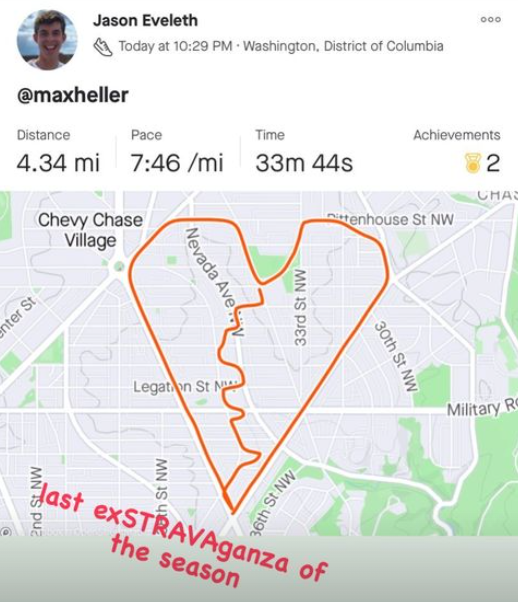
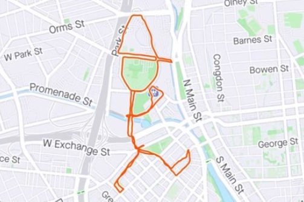
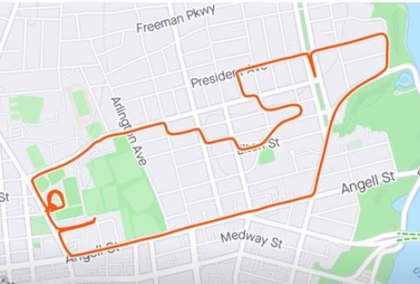

# Fun Run Mapper

A tool to find the best strava art run.

Strava is a social media app centered around exercise, in particular running and biking. When a user records a run on their GPS watch, their activity is automatically uploaded to Strava, showing among other things a trace of the runner’s path on a map. One fun way users can interact with this feature is to run a particular route such that the trace resembles a particular shape. A user could, for example, run a route that traces out the shape of a dinosaur. Crafting artistic routes is a slow and difficult process for humans (trust us, we’ve tried), which raises the question of whether this can be automated using machine learning techniques. Here are some examples of strava art.

We implemented 2 algorithms: point cloud affine transform, and list of paths.

## Algorithm 1: Point cloud approach

The user drawing is turned into a point cloud. The goal is to find the affine embedding of the points into the plane which minimizes the mean squared distance from the points to their nearest neighbors in the graph.

## Algorithm 2: List of paths

After completing our point cloud implementation, we developed another solution that interprets user input as a list of paths. The key idea of this approach is to try to incorporate as much semantic information from the drawing as possible by enforcing that the output subgraph have the same topology as the input. This solution has two phases. The first is an initialization phase where a subgraph is constructed that resembles the input in topology and shape. The second is an optional local optimization phase where random perturbations are made and beneficial ones are kept.

Our algorithm takes the input paths and glues them together into a graph. It does this by making connections between vertices on different paths that are within a certain threshold of each other, with great care being taken to make sure that only one connection is made for each intersection, as opposed to a dense bipartite graph between the two segments around the intersection point. We also glue paths to themselves at self-intersections, again taking care to only connect proper, non-trivial intersections. There is also a filtering routine, which removes extraneous branches which are below a certain length threshold. The idea is that these are likely artifacts of the gluing process or imprecise drawing, and are not intentional additions by the user.

Once the user input graph is glued together, we break it back down into segments that are drawn independently. Segments are, with one exception, paths with endpoints at non-degree-2 vertices, and with exclusively degree-2 vertices in their interiors. The exception is in the handling of loops from high-degree vertices back to themselves. Because we want segments to have distinct endpoints, loops are broken up into 2 segments.

Once we have a segmented graph, we call a vertex a *critical vertex* if it is the endpoint of a segment. Similarly to in the first implementation, we perform a random affine embedding of the critical vertices into the map. We then map each critical vertex to the nearest vertex of the map graph. We embed each segment according to the unique rotation-dilation-translation concatenation that could take the segment's endpoints directly to where they ended up.

We construct a path in the graph corresponding to a segment by starting at one endpoint and moving to the unseen neighboring vertex which is in a direction most aligned with the vector field. If we get stuck, we just complete the path with the $A^*$ algorithm.

## Future directions

Reward modeling using website-user generated data.
